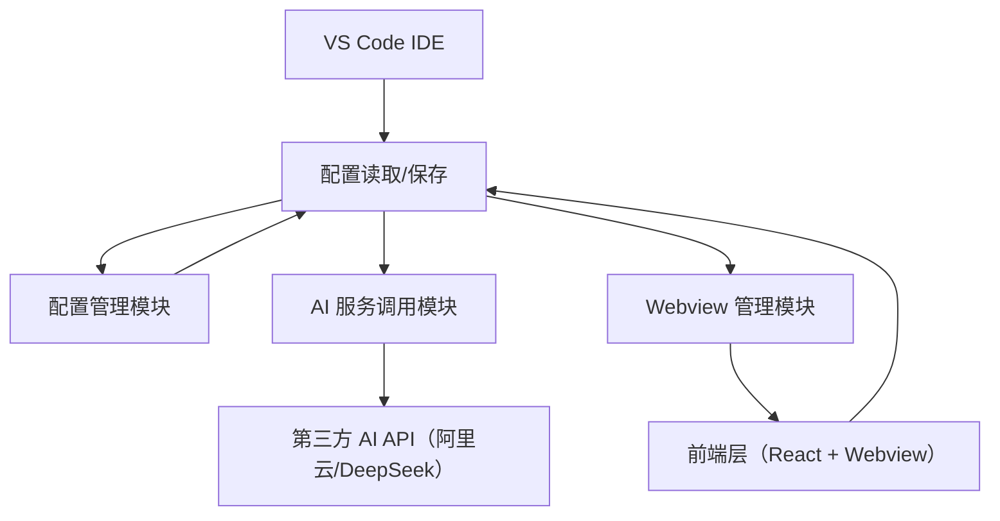
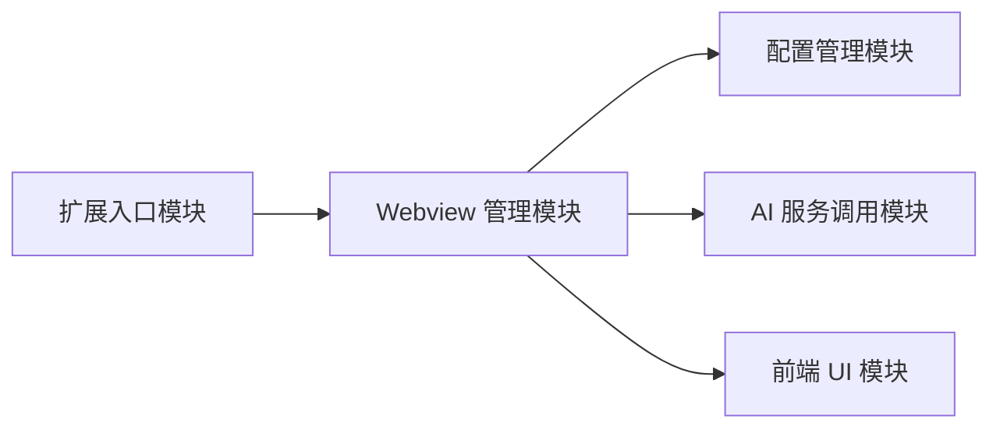

# Coding Agent 插件开发说明文档
## 一、文档概述
本文档为 Coding Agent VS Code 插件的开发说明文档，涵盖插件的技术架构、功能模块、配置与使用指南，适用于开发人员学习、维护和扩展该插件。

## 二、技术架构与实现方案
### 2.1 整体架构
插件采用「扩展端（Node.js）+ 前端（Webview）」的经典 VS Code 插件架构，核心分为**扩展层**（处理 VS Code 原生能力、AI API 调用）和**前端层**（Webview 交互界面），两层通过 VS Code 提供的消息通信机制实现双向数据交互。



### 2.2 技术栈选型
| 层级       | 核心技术                          | 作用说明                     |
|------------|-----------------------------------|------------------------------|
| 扩展端     | Node.js + TypeScript + VS Code API | 插件初始化、命令注册、API 调用 |
| 前端层     | React + TypeScript + Vite         | Webview 界面渲染、用户交互   |
| 通信层     | VS Code Webview 消息机制          | 扩展端↔前端层双向通信       |
| 依赖管理   | npm                               | 包管理、依赖安装             |
| 构建工具   | tsc（扩展端）+ Vite（前端）       | 代码编译、打包               |

### 2.3 核心实现方案
#### 2.3.1 前后端通信方案
- 扩展端通过 `webview.onDidReceiveMessage` 监听前端消息，通过 `webview.postMessage` 向前端发送消息；
- 前端通过 `acquireVsCodeApi()` 获取 VS Code 原生 API，通过 `postMessage` 向扩展端发消息，通过 `addEventListener('message')` 监听扩展端消息；
- 消息格式统一为 `{ type: 消息类型, data: 消息数据 }`，确保通信规范。

#### 2.3.2 AI 服务调用方案
- 采用「策略模式」封装多服务商 AI API 调用逻辑，支持阿里云、DeepSeek 等服务商扩展；
- 扩展端异步调用 AI API，通过 try/catch 处理异常，确保插件稳定性；
- 配置中心化管理，从 VS Code 配置项读取 API Key、服务商等信息，避免硬编码。

#### 2.3.3 Webview 加载方案
- 前端代码通过 Vite 打包为静态资源，扩展端通过 `webview.asWebviewUri` 生成安全的本地资源路径；
- Webview 初始化时注入扩展端配置（如当前服务商），确保前端无需重复请求；
- 启用 `retainContextWhenHidden` 保持 Webview 上下文，避免面板隐藏后状态丢失。

## 三、功能模块详细说明
### 3.1 模块总览
插件分为 5 个核心模块，模块间依赖关系如下：


### 3.2 扩展入口模块（extension.ts）
#### 3.2.1 核心作用
- 插件激活/卸载的生命周期管理；
- 注册 VS Code 命令，作为插件入口；
- 初始化单例 Webview 管理器。

#### 3.2.2 关键代码逻辑
```typescript
// 插件激活函数（VS Code 启动/首次调用插件时执行）
export function activate(context: vscode.ExtensionContext) {
  // 注册“打开 AI 助手”命令
  const disposable = vscode.commands.registerCommand(
    'coding-agent-chat.openChat', 
    () => {
      // 初始化并显示 Webview 面板
      WebviewManager.getInstance().showPanel(context);
    }
  );
  // 注册到上下文，插件卸载时自动清理
  context.subscriptions.push(disposable);
}

// 插件卸载函数（资源清理）
export function deactivate() {
  WebviewManager.getInstance().dispose(); // 销毁 Webview 面板
}
```

#### 3.2.3 核心 API 说明
| API 名称                          | 作用                     |
|-----------------------------------|--------------------------|
| vscode.commands.registerCommand   | 注册 VS Code 命令        |
| context.subscriptions.push        | 注册资源清理钩子         |

### 3.3 Webview 管理模块（WebviewManager.ts）
#### 3.3.1 核心作用
- 创建/销毁 Webview 面板，管理面板生命周期；
- 处理扩展端与前端的消息通信；
- 加载前端静态资源，生成 Webview HTML 模板。

#### 3.3.2 核心子功能
##### （1）Webview 面板创建
```typescript
public showPanel(context: vscode.ExtensionContext) {
  // 销毁旧面板，避免重复创建
  if (this.panel) this.panel.dispose();
  // 创建新面板
  this.panel = vscode.window.createWebviewPanel(
    'coding-agent-chat', // 面板唯一 ID
    'AI 编程助手',       // 面板标题
    vscode.ViewColumn.Three, // 显示位置（右侧编辑器栏）
    {
      enableScripts: true, // 允许执行 JS
      retainContextWhenHidden: true, // 隐藏时保留上下文
      localResourceRoots: [vscode.Uri.file(context.extensionPath)] // 允许加载本地资源
    }
  );
  // 加载前端页面
  this.panel.webview.html = this.getWebviewHtml(context);
  // 注册消息监听
  this.registerWebviewMessageListener();
}
```

##### （2）前后端消息通信
```typescript
// 监听前端消息
private registerWebviewMessageListener() {
  this.panel?.webview.onDidReceiveMessage(async (message) => {
    switch (message.type) {
      case 'send-message': // 处理用户发送的问题
        await this.handleSendMessage(message.content, message.provider);
        break;
      case 'request-config': // 处理前端配置请求
        this.sendConfigToFrontend();
        break;
    }
  });
}

// 发送 AI 回复到前端
private async handleSendMessage(content: string, provider: string) {
  try {
    const response = await MultiAiService.callApi(content, provider);
    this.panel?.webview.postMessage({
      type: 'message-response',
      data: { id: Date.now().toString(), content: response, role: 'assistant' }
    });
  } catch (error) {
    this.panel?.webview.postMessage({
      type: 'message-response',
      data: { id: Date.now().toString(), content: `请求失败：${error}`, role: 'assistant' }
    });
  }
}
```

#### 3.3.3 核心 API 说明
| API 名称                          | 作用                     |
|-----------------------------------|--------------------------|
| vscode.window.createWebviewPanel  | 创建 Webview 面板        |
| webview.onDidReceiveMessage       | 监听前端消息             |
| webview.postMessage               | 向前端发送消息           |
| webview.asWebviewUri              | 生成安全的本地资源路径   |

### 3.4 配置管理模块（ConfigManager.ts）
#### 3.4.1 核心作用
- 统一读取/管理 VS Code 插件配置项；
- 提供配置项的默认值，避免空值异常；
- 为 AI 服务模块提供配置支持（如 API Key、服务商）。

#### 3.4.2 核心代码
```typescript
export class ConfigManager {
  // 获取当前选中的 AI 服务商
  public static getCurrentProvider(): string {
    return vscode.workspace.getConfiguration('coding-agent-chat').get('provider', 'deepseek');
  }

  // 获取阿里云 API Key
  public static getAliyunApiKey(): string {
    return vscode.workspace.getConfiguration('coding-agent-chat').get('aliyunApiKey', '');
  }

  // 获取 DeepSeek API Key
  public static getDeepSeekApiKey(): string {
    return vscode.workspace.getConfiguration('coding-agent-chat').get('deepSeekApiKey', '');
  }

  // 获取代理启用状态
  public static getProxyEnabled(): boolean {
    return vscode.workspace.getConfiguration('coding-agent-chat').get('proxyEnabled', false);
  }
}
```

### 3.5 AI 服务调用模块（MultiAiService.ts）
#### 3.5.1 核心作用
- 封装多服务商 AI API 调用逻辑，支持扩展新服务商；
- 处理 API 请求参数、响应解析、异常捕获；
- 适配不同服务商的 API 格式，提供统一的调用接口。

#### 3.5.2 核心代码
```typescript
export class MultiAiService {
  // 统一调用入口
  public static async callApi(content: string, provider: string): Promise<string> {
    switch (provider) {
      case 'aliyun':
        return this.callAliyunApi(content);
      case 'deepseek':
        return this.callDeepSeekApi(content);
      default:
        throw new Error(`不支持的 AI 服务商：${provider}`);
    }
  }

  // 阿里云 API 调用
  private static async callAliyunApi(content: string): Promise<string> {
    const apiKey = ConfigManager.getAliyunApiKey();
    if (!apiKey) throw new Error('未配置阿里云 API Key');
    
    // 构造请求参数（适配阿里云 API 格式）
    const requestData = {
      messages: [{ role: 'user', content }],
      model: 'qwen-turbo'
    };

    // 发送请求（示例，需替换为真实阿里云 API 地址）
    const response = await fetch('https://dashscope.aliyuncs.com/api/v1/services/aigc/text-generation/generation', {
      method: 'POST',
      headers: {
        'Authorization': `Bearer ${apiKey}`,
        'Content-Type': 'application/json'
      },
      body: JSON.stringify(requestData)
    });

    const result = await response.json();
    return result.output?.text || 'AI 回复为空';
  }

  // DeepSeek API 调用（类似阿里云，适配 DeepSeek 格式）
  private static async callDeepSeekApi(content: string): Promise<string> {
    const apiKey = ConfigManager.getDeepSeekApiKey();
    if (!apiKey) throw new Error('未配置 DeepSeek API Key');
    
    // 构造请求参数（适配 DeepSeek API 格式）
    const requestData = {
      messages: [{ role: 'user', content }],
      model: 'deepseek-chat'
    };

    const response = await fetch('https://api.deepseek.com/v1/chat/completions', {
      method: 'POST',
      headers: {
        'Authorization': `Bearer ${apiKey}`,
        'Content-Type': 'application/json'
      },
      body: JSON.stringify(requestData)
    });

    const result = await response.json();
    return result.choices[0]?.message?.content || 'AI 回复为空';
  }
}
```

### 3.6 前端 UI 模块（webview-ui/）
#### 3.6.1 核心作用
- 渲染聊天界面，展示用户消息和 AI 回复；
- 处理用户交互（输入问题、发送消息、清空聊天）；
- 与扩展端通信，发送用户操作指令，接收 AI 回复。

#### 3.6.2 核心子模块
##### （1）VS Code API 封装（vscodeApi.ts）
```typescript
import React from 'react';
import { InitConfig, MessageType } from './globalTypes';

// 封装 VS Code API，适配 Webview 环境
export const createVscodeApi = () => {
  const vscode = window.vscode; // 扩展端注入的全局对象
  if (!vscode) throw new Error('请在 VS Code 中运行该插件');

  // 合并初始配置
  const initConfig: InitConfig = {
    provider: 'deepseek',
    proxyEnabled: false,
    ...window.initConfig
  };

  // 发送消息到扩展端
  const postVscodeMessage = (type: MessageType, data: Record<string, any> = {}) => {
    vscode.postMessage({ type, ...data });
  };

  return { initConfig, postVscodeMessage, vscode };
};

// 监听扩展端消息的 Hook
export const useVscodeMessageListener = (callback: (message: { type: MessageType; data: any }) => void) => {
  React.useEffect(() => {
    const handleMessage = (event: MessageEvent) => {
      if (event.data && event.data.type) callback(event.data);
    };
    window.addEventListener('message', handleMessage);
    return () => window.removeEventListener('message', handleMessage);
  }, [callback]);
};
```

##### （2）聊天面板组件（ChatPanel.tsx）
```typescript
import React, { useState } from 'react';
import { createVscodeApi, useVscodeMessageListener } from './utils/vscodeApi';
import { Message } from './globalTypes';

const ChatPanel = () => {
  const [messages, setMessages] = useState<Message[]>([]);
  const [inputValue, setInputValue] = useState('');
  const { initConfig, postVscodeMessage } = createVscodeApi();

  // 监听扩展端消息
  useVscodeMessageListener((message) => {
    switch (message.type) {
      case 'message-response':
        // 替换“正在思考”占位消息为 AI 回复
        setMessages(prev => prev.map(msg => 
          msg.id.startsWith('loading_') ? message.data : msg
        ));
        break;
      case 'messages-cleared':
        setMessages([]);
        break;
    }
  });

  // 发送消息
  const handleSend = () => {
    if (!inputValue.trim()) return;
    // 添加用户消息
    const userMsg: Message = {
      id: `user_${Date.now()}`,
      content: inputValue,
      role: 'user',
      timestamp: Date.now()
    };
    // 添加加载占位消息
    const loadingMsg: Message = {
      id: `loading_${Date.now()}`,
      content: '正在思考...',
      role: 'assistant',
      timestamp: Date.now()
    };
    setMessages(prev => [...prev, userMsg, loadingMsg]);
    // 发送到扩展端
    postVscodeMessage('send-message', {
      content: inputValue,
      provider: initConfig.provider
    });
    setInputValue('');
  };

  // 清空聊天
  const handleClear = () => {
    postVscodeMessage('clear-messages');
    setMessages([]);
  };

  // 格式化时间
  const formatTime = (timestamp: number) => {
    return new Date(timestamp).toLocaleTimeString('zh-CN', {
      hour: '2-digit',
      minute: '2-digit',
      second: '2-digit'
    });
  };

  return (
    <div style={{ padding: '20px', fontFamily: 'sans-serif', height: '100vh', boxSizing: 'border-box' }}>
      <button onClick={handleClear} style={{ marginBottom: '10px', padding: '4px 8px' }}>
        清空聊天
      </button>
      <div 
        style={{ 
          height: 'calc(100vh - 120px)', 
          border: '1px solid #eee', 
          padding: '10px', 
          overflowY: 'auto',
          marginBottom: '10px'
        }}
      >
        {messages.length === 0 ? (
          <div style={{ color: '#999', textAlign: 'center', padding: '40px 0' }}>
            请输入问题，开始与 AI 对话
            <div style={{ fontSize: '12px', marginTop: '8px' }}>当前服务商：{initConfig.provider}</div>
          </div>
        ) : (
          messages.map(msg => (
            <div 
              key={msg.id}
              style={{ 
                margin: '8px 0', 
                padding: '8px 12px',
                backgroundColor: msg.role === 'user' ? '#e6f7ff' : '#f5f5f5',
                borderRadius: '6px',
                maxWidth: '80%',
                marginLeft: msg.role === 'user' ? 'auto' : 0
              }}
            >
              <div style={{ fontWeight: '600', fontSize: '14px' }}>
                {msg.role === 'user' ? '你' : 'AI'}
                <span style={{ fontWeight: 'normal', color: '#999', marginLeft: '8px', fontSize: '12px' }}>
                  {formatTime(msg.timestamp)}
                </span>
              </div>
              <div style={{ marginTop: '4px', whiteSpace: 'pre-wrap', wordBreak: 'break-all' }}>
                {msg.content}
              </div>
            </div>
          ))
        )}
      </div>
      <div style={{ display: 'flex', gap: '8px' }}>
        <input
          value={inputValue}
          onChange={(e) => setInputValue(e.target.value)}
          onKeyDown={(e) => e.key === 'Enter' && !e.shiftKey && handleSend()}
          placeholder={`输入问题（当前服务商：${initConfig.provider}）`}
          style={{ flex: 1, padding: '10px', border: '1px solid #ddd', borderRadius: '6px', outline: 'none' }}
        />
        <button 
          onClick={handleSend} 
          disabled={!inputValue.trim()}
          style={{ 
            padding: '10px 20px', 
            backgroundColor: inputValue.trim() ? '#0078d4' : '#ccc',
            color: 'white',
            border: 'none',
            borderRadius: '6px',
            cursor: inputValue.trim() ? 'pointer' : 'not-allowed'
          }}
        >
          发送
        </button>
      </div>
    </div>
  );
};

export default ChatPanel;
```

## 四、配置与使用指南
### 4.1 环境准备
#### 4.1.1 开发环境
- Node.js ≥ 16.0.0
- npm ≥ 7.0.0
- VS Code ≥ 1.80.0
- TypeScript ≥ 5.0.0

#### 4.1.2 依赖安装
```bash
# 进入插件根目录
cd vscode-deepseek-assistant
# 安装扩展端依赖
npm install
# 进入前端目录，安装前端依赖
cd webview-ui
npm install
```

### 4.2 配置说明
#### 4.2.1 配置项定义（package.json）
插件配置项在 `package.json` 的 `contributes.configuration` 中定义：
```json
{
  "contributes": {
    "configuration": {
      "title": "Coding Agent",
      "properties": {
        "coding-agent-chat.provider": {
          "type": "string",
          "default": "deepseek",
          "enum": ["aliyun", "deepseek"],
          "description": "AI 服务商（支持阿里云/DeepSeek）"
        },
        "coding-agent-chat.aliyunApiKey": {
          "type": "string",
          "default": "",
          "description": "阿里云 DashScope API Key"
        },
        "coding-agent-chat.deepSeekApiKey": {
          "type": "string",
          "default": "",
          "description": "DeepSeek API Key"
        },
        "coding-agent-chat.proxyEnabled": {
          "type": "boolean",
          "default": false,
          "description": "是否启用代理（访问 AI API 时）"
        }
      }
    }
  }
}
```

#### 4.2.2 配置方式
1. 打开 VS Code 设置（快捷键 `Ctrl+,` / `Cmd+,`）；
2. 在搜索框输入 `Coding Agent`，找到对应配置项；
3. 设置 AI 服务商、API Key 等参数；
4. 保存配置后，重启插件生效。

### 4.3 编译与运行
#### 4.3.1 前端代码打包
```bash
# 进入前端目录
cd webview-ui
# 打包前端代码（输出到 out/webview/react）
npm run build
```

#### 4.3.2 扩展端代码编译
```bash
# 回到插件根目录
cd ..
# 编译 TypeScript 代码（输出到 out 目录）
npm run compile
```

#### 4.3.3 运行插件
1. 打开 VS Code，切换到「运行和调试」面板（快捷键 `F5`）；
2. 选择「Launch Extension」配置；
3. 点击「启动调试」，会打开新的 VS Code 窗口，插件自动加载；
4. 在新窗口中，通过快捷键 `Ctrl+Shift+P` / `Cmd+Shift+P` 输入 `Coding Agent: 打开 AI 助手`，启动插件。

### 4.4 使用指南
#### 4.4.1 基础使用
1. 启动插件后，右侧会打开「AI 编程助手」面板；
2. 在输入框中输入编程相关问题（如“如何用 TypeScript 封装 Axios”）；
3. 点击「发送」按钮或按回车键，插件会调用 AI API 并展示回复；
4. 点击「清空聊天」可清空所有消息记录。

#### 4.4.2 切换 AI 服务商
1. 在 VS Code 设置中修改 `coding-agent-chat.provider` 为 `aliyun` 或 `deepseek`；
2. 确保对应服务商的 API Key 已配置；
3. 重启插件后，新的服务商生效。

#### 4.4.3 常见问题解决
| 问题现象                | 解决方案                                                                 |
|-------------------------|--------------------------------------------------------------------------|
| AI 回复为空             | 检查 API Key 是否正确，服务商是否匹配                                   |
| 请求失败                | 检查网络是否正常，若需代理则启用 `proxyEnabled` 配置                     |
| Webview 面板无法打开    | 检查扩展端代码是否编译成功，前端资源是否打包到正确目录                   |
| 前端提示“非 VS Code 环境” | 确保 Webview HTML 模板中正确注入 `acquireVsCodeApi`，且前端未打包该 API  |

### 4.5 扩展开发指南
#### 4.5.1 添加新的 AI 服务商
1. 在 `ConfigManager.ts` 中添加新服务商的配置读取方法；
2. 在 `MultiAiService.ts` 中添加新服务商的 API 调用方法；
3. 在 `package.json` 中扩展 `provider` 配置项的枚举值；
4. 重新编译插件，配置新服务商的 API Key 即可使用。

#### 4.5.2 扩展前端功能
1. 在 `webview-ui/src/globalTypes.ts` 中扩展消息类型/配置类型；
2. 在 `ChatPanel.tsx` 中添加新的 UI 组件和交互逻辑；
3. 重新打包前端代码，编译扩展端代码后测试。

## 五、总结
Coding Agent 插件基于 VS Code 插件架构，通过扩展端处理 AI API 调用和配置管理，前端层提供友好的交互界面，实现了“输入问题→调用 AI→展示回复”的核心流程。插件采用模块化设计，支持多 AI 服务商扩展，配置灵活，使用简单。

后续可扩展的方向包括：支持更多 AI 服务商、添加消息历史记录、实现代码片段插入、优化前端交互体验等。